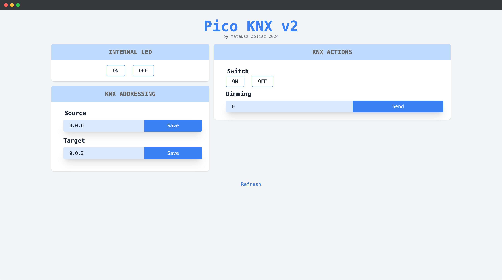
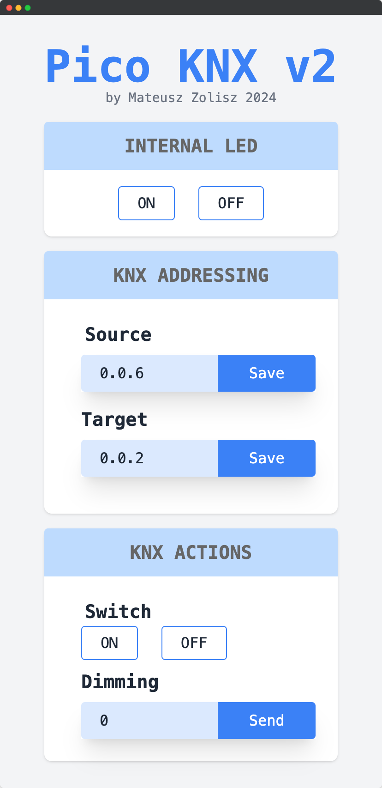

# Pico KNX v2 Project

## Overview

The objective of this project is to develop a device that can control KNX network devices. The device is designed to interface with the Siemens TP-UART2 BCU 5WG1 117-2AB12 and supports operations such as:

- Setting the source and target KNX addresses
- Sending SWITCH type messages to KNX devices
- Sending DIMMING type messages to KNX devices
- Controlling the built-in LED on the Raspberry Pi Pico

The entire system is managed through a web interface.

## Functionality

The device can operate in two modes: AP (Access Point) and STA (Station). By default, it connects in STA mode. When the button at the bottom of the device is pressed during power-up (MicroUSB +5V), the device switches to Access Point mode.

The OLED display shows three addresses by default:
- IP Address
- Source KNX Address
- Target KNX Address

The web application is hosted at the displayed IP address. Each KNX action is signaled as an event on the OLED display and the appropriate frame is sent to the KNX interface.

## Hardware

- Raspberry Pi Pico W
- SSD1306 OLED Display
- Button
- IDC Socket

## Software

The software for the Raspberry Pi Pico is written in C and includes:
- A library for creating KNX standard frames
- A driver for the OLED display
- A WebServer hosting an application for controlling devices

### KNX Telegram Library

This library, written by me (available at [knx-telegram](https://github.com/Zomat/knx-telegram)), is a minimalist library offering basic functionalities such as:
- Setting and getting the control field
- Setting and getting the source device address
- Setting and getting the target device address and its type (group/individual)
- Setting and getting the routing counter
- Setting and getting the data field and its length
- Calculating the checksum

The library is responsible only for creating telegrams, not for sending them. Thus, it can be used on any microcontroller. Sending telegrams requires using the UART module, which varies depending on the microcontroller.

### KNX Telegram Structure

A KNX telegram consists of the following fields:
- Control Field → 1 byte
- Source Address → 2 bytes
- Destination Address → 2 bytes + 1 bit
- Routing Counter → 3 bits
- Data Field Length → 4 bits
- Data Field → up to 16 bytes
- Checksum → 1 byte

#### Example KNX Frame

HEX Format: `BC 00 01 00 02 E1 00 81 20`

Binary Format: (provided in original documentation)

### Sending Telegram to TP-UART2 Interface

To communicate with the TP-UART2 interface, simply sending a KNX telegram is insufficient. Each byte of the telegram must be preceded by an appropriate DataStart, DataContinue, or DataEnd byte. Therefore, for our example telegram, the frame to send to the TP-UART2 interface would be:

`80 BC 81 00 82 01 83 00 84 02 85 E1 86 00 87 81 48 20`

### WebServer

The LwIP library was used to implement network functions. LwIP is a widely used open-source TCP/IP stack designed for embedded systems.

### SSD1306 Display Driver

I wrote the display driver from scratch (available at [ssd1306-i2c-driver](https://github.com/Zomat/ssd1306-i2c-driver)). It offers essential functions for displaying text and images on the display, with font-changing options.

## Conclusion

This project successfully demonstrates the ability to control KNX network devices using a Raspberry Pi Pico, integrating hardware and software components effectively to provide a robust and user-friendly control interface through a web application.